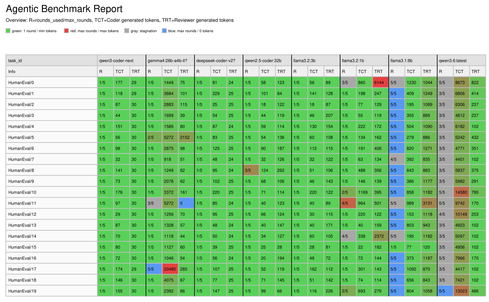
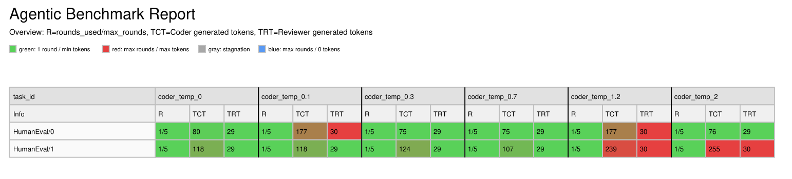
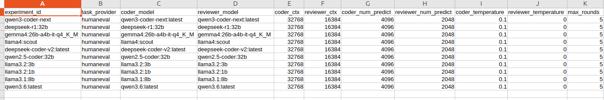
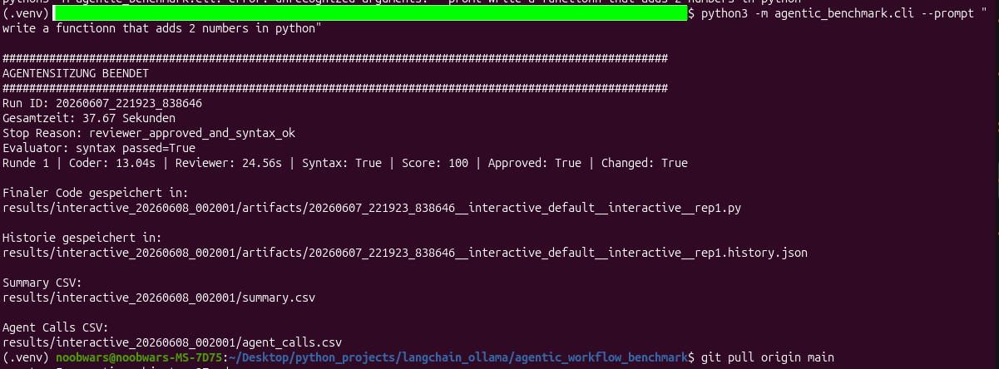

# agentic_loop_benchmark_for_local_llms

A beginner-friendly local tool for trying and benchmarking **agentic Coder/Reviewer loops** with local Ollama models.

## Friendly Start :-)

### How to directly use it in Ubuntu:

Prepare Environment:

```bash
git clone https://github.com/AndreBaldermann/agentic_loop_benchmark_for_local_llms.git
cd agentic_loop_benchmark_for_local_llms
python -m venv .venv
pip install -r requirements.txt
```

Now you need local llms. Install ollama if you dont have it, yet:

```bash
curl -fsSL https://ollama.com/install.sh | sh
ollama --version
```

Install llms for running the demo without editing. Requires ca. 77 GB of memory:

```bash
ollama pull qwen3-coder-next
ollama pull gemma4:26b-a4b-it-q4_K_M
ollama pull deepseek-coder-v2
ollama pull qwen2.5:32b
ollama pull llama3.2:3b
ollama pull llama3.2:1b
ollama pull llama3.1:8b
```

Run the demo:

```bash
python3 basis_agentic_coding_loop.py \
  --config configs/loop_configs.csv \
  --prompt "Write a Python function add(x, y) that returns x + y." \
  --pdf-report
```

Open the PDF-File under:

```text
report/interactive_{date_time}/summary.pdf
```
### How to directly use it on Windows 10 / 11

Open **PowerShell** and clone the repository:

```powershell
git clone https://github.com/AndreBaldermann/agentic_loop_benchmark_for_local_llms.git
cd agentic_loop_benchmark_for_local_llms
```

Create and activate a virtual environment:

```powershell
python -m venv .venv
.venv\Scripts\activate
```

Install dependencies:

```powershell
pip install -r requirements.txt
```

Now you need local LLMs. Install Ollama if you do not have it yet:

1. Download and install Ollama from:
   https://ollama.com/download/windows

2. Verify the installation:

```powershell
ollama --version
```

Install the models required for the demo (approximately 77 GB disk space):

```powershell
ollama pull qwen3-coder-next
ollama pull gemma4:26b-a4b-it-q4_K_M
ollama pull deepseek-coder-v2
ollama pull qwen2.5:32b
ollama pull llama3.2:3b
ollama pull llama3.2:1b
ollama pull llama3.1:8b
```

Run the demo:

```powershell
python basis_agentic_coding_loop.py `
  --config configs/loop_configs.csv `
  --prompt "Write a Python function add(x, y) that returns x + y." `
  --pdf-report
```

Open the generated PDF report:

```text
report\interactive_{date_time}\summary.pdf
```

## Friendly config

Open the config file in:

```text
configs/loop_configs.csv
```

It should be largely self-explanatory:

The agentic loop currently consists of a coder and a reviewer.
Each row is a different experiment where you define specifics about the coder and reviewer behavior

Tokens? What's a token? 
LLMs neither predict the next letter nor the next word. They predict reusable letter combinations. Like the word "predict" 
consists of 2 tokens: "pre" and "dict". For source code the tokens are shorter than for natural language. 

The config file:

| Field                | Description                                                                                                                        |
| -------------------- | ---------------------------------------------------------------------------------------------------------------------------------- |
| experiment_id        | Just an arbitrary name you can choose                                                                                              |
| task_provider        | Relevant for "benchmark run" command. HumanEval is a standard test set of 164 tasks by OpenAI.                                     |
| coder_model          | Put in the LLMs you want to test. Find options on your system by executing command `ollama list`.                                  |
| reviewer_model       | Analog to the coder_model, see above.                                                                                              |
| coder_ctx            | Coder context window. 32k tokens is a good start. Most local LLMs should be more capable.                                          |
| reviewer_ctx         | Reviewer context window.                                                                                                           |
| coder_num_predict    | Maximum length of response before model stops execution. Good for short simple codes.                                              |
| reviewer_num_predict | Analog to the coder_num_predict, see above.                                                                                        |
| coder_temperature    | Creativity of the LLM. Also may lead to hallucinations. For the coder a value of 0.1 to 0.3 is generally considered good practice. |
| reviewer_temperature | Analog to the coder_num_predict, see above.                                                                                        |
| max_rounds           | Maximum number of unsuccessful coder/reviewer interactions before the test is forcefully stopped.                                  |
| max_same_code_rounds | Like in chess. Repeat the same move twice, game over.                                                                              |

## 3. Some Pics

### Example 1: PDF Report of a variety of LLMs solving HumanEval Benchmark from OpenAI



### Example 2: PDF Report of qwen coder solving HumanEval Benchmark from OpenAI at different temperatures



### Example 3:Config File



### Example 4: Full program output of a single agentic experiment




## 2. Validate loop configurations

Before running many experiments, check that the CSV is valid:

```bash
python3 -m agentic_benchmark.cli validate-config --config configs/loop_configs.csv
```

## 3. Structured benchmark run

Use this when you want repeatable tests over a task corpus such as HumanEval:

```bash
python3 -m agentic_benchmark.cli run \
  --config configs/loop_configs.csv \
  --tasks data/humaneval/HumanEval.jsonl.gz \
  --limit 10 \
  --pdf-report
```

The benchmark writes a timestamped result directory containing:

- `summary.csv`: one row per task/configuration/repetition
- `agent_calls.csv`: one row per concrete Coder or Reviewer model call
- `artifacts/`: final generated code and per-run JSON history
- a snapshot copy of the config CSV
- `reports/run_YYYYMMDD_HHMMSS/overview.pdf` when `--pdf-report` is used

## 4. Generate overview PDF later

```bash
python3 -m agentic_benchmark.cli report-pdf \
  --summary results/run_YYYYMMDD_HHMMSS/summary.csv \
  --agent-calls results/run_YYYYMMDD_HHMMSS/agent_calls.csv \
  --output reports/overview.pdf
```

The PDF overview contains multiple matrix tables with the same task/experiment layout: `R/TCT/TRT` for rounds and generated tokens, `TTNL/TTC/TTR` for execution time without model loading, `TTL/TLC/TLR` for load time, `ATPS/CTPS/RTPS` for generated-token throughput, `FC/TO/ERR` for failures, `SYN/APP/EVAL` for quality signals, and `Q/QPS/QPK` for simple efficiency views. Use `--pdf-transpose` or `report-pdf --transpose` to swap tasks and experiments. Wide reports automatically switch from A4 landscape to A3/A2/A1/A0 as the number of visible columns grows.

## CLI reference

See [docs/cli.md](docs/cli.md) for the full command reference, option descriptions, examples, and the CLI help smoke-test command.

## Evaluators

The benchmark focuses on agentic-loop behavior, timing, tokens, and interaction metrics. Evaluators are optional and configurable per row:

- `none`: do not evaluate generated code
- `syntax`: run a local Python syntax check
- `humaneval`: run HumanEval tests in a subprocess with timeout

## Failure handling and fair loading

For fair per-task comparisons the sample config uses `load_mode=cold`, which unloads Coder and Reviewer models before each task/repetition. Within a task, the loop can still run multiple Coder/Reviewer iterations using the configured context windows.

Model call failures, including Ollama URL errors, invalid JSON, backend errors, and timeouts, are recorded as failed agent calls instead of aborting the whole benchmark. Failed calls get zero backend token counts and zero backend execution/load durations, plus `call_failed`, `error_type`, and `error_message` fields in `agent_calls.csv`.
